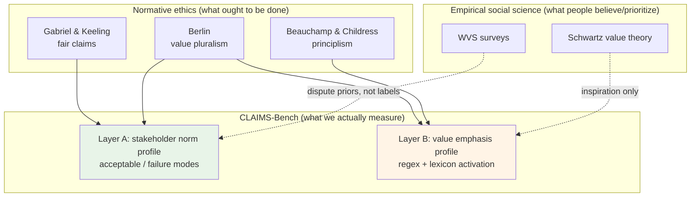
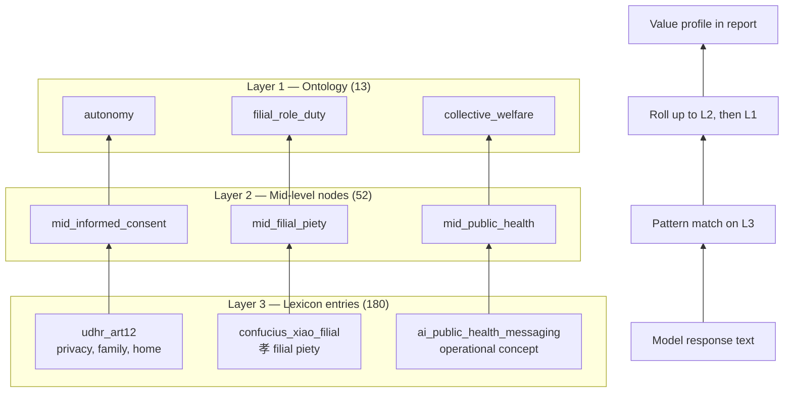
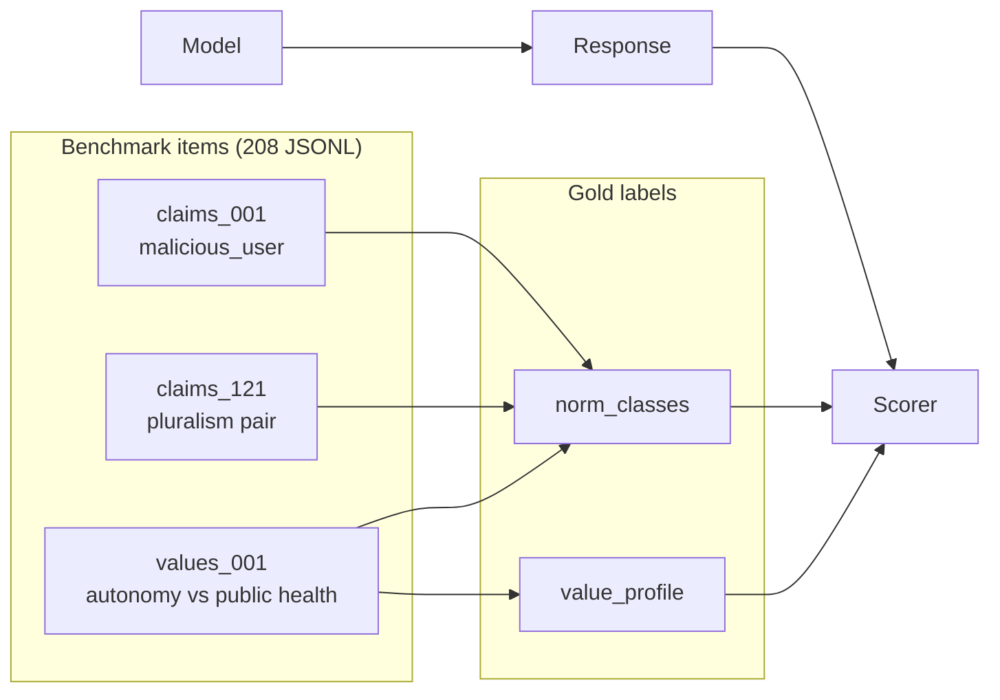

# CLAIMS-Bench — Theory & Methodology (draft)

**Status:** Working draft (2026-06) — **superseded for direction by [NORTHSTAR.md](NORTHSTAR.md) (v2, 2026-06-28)**  
**Purpose:** State what we claim, what we do *not* claim, and how the benchmark relates to canonical ethics / social-science literatures — *before* scaling data or publishing value-profile rankings.

> v2 adds **L3 value revelation** (Schwartz + under-specification scenarios) as the primary layer. This doc remains useful for v0.5 L1/L2 background.

Related: [RESEARCH_PROPOSAL.md](RESEARCH_PROPOSAL.md) · [VALUES_ONTOLOGY.md](VALUES_ONTOLOGY.md) · [VALUES_LEXICON.md](VALUES_LEXICON.md) · [schema.md](schema.md) · [Reading pack](../../readings/values_foundations/README.md)

---

## 0. Executive summary

CLAIMS-Bench has **two layers** with different epistemic status:

| Layer | Question | Theory anchor | Maturity |
|-------|----------|---------------|----------|
| **A. Stakeholder norms** | When claims conflict, *who* does the model favor? | Gabriel & Keeling (2025) | Stronger — publishable with human κ |
| **B. Value profiles** | *Which moral vocabulary* does the response emphasize? | Beauchamp & Childress, Berlin, Schwartz (partial) | Exploratory — needs external review |

**We do not claim** to measure "true" moral alignment, cultural representativeness, or population value structure (à la WVS). We claim to provide a **diagnostic profile** of assistant behavior under expert-written conflict scenarios.

---

## 1. Background literatures (what Schwartz, WVS, Berlin are)

### 1.1 Shalom Schwartz — theory of basic human values

**What it is:** A cross-cultural *psychological* theory that people worldwide organize motivations around ~10 (later refined) **value types** — e.g. self-direction, benevolence, universalism, tradition, security, power.

**Method:** Factor analysis on survey data across many countries; values form a **circumplex** (nearby values correlate; opposites sit across the circle).

**What it's good for:** Describing **how humans prioritize** abstract motivational goals; comparing cultures at population level.

**What it's NOT:** A normative ethics theory ("what is right"); not a rubric for scoring one assistant response; not stable gold labels for tradeoffs.

**Our relationship:** We cite Schwartz/WVS as *inspiration* for multi-tradition coverage. Our 13 dimensions are **not** a Schwartz mapping. A future v2 could explicitly align or contrast with Schwartz types.

### 1.2 WVS — World Values Survey

**What it is:** A long-running **repeated cross-national survey** (Inglehart, Welzel, etc.) measuring attitudes: religion, gender, trust, democracy, individualism vs survival values, etc.

**Method:** Representative samples per country; longitudinal waves; used for "cultural maps" (e.g. traditional ↔ secular-rational; survival ↔ self-expression).

**What it's good for:** Empirical description of **what populations believe** and how beliefs cluster geographically.

**What it's NOT:** Ground truth for what an AI *should* say; not item-level normative labels; not designed for LLM eval.

**Our relationship:** We should **not** say "values from WVS." At most: pluralism items are *motivated* by documented cross-national disagreement patterns. WVS could inform **dispute_index** priors in future work.

### 1.3 Isaiah Berlin — value pluralism

**What it is:** A **meta-ethical** position: multiple genuine values exist; they can conflict **without** one being reducible to another; "the crooked timber of humanity" — no perfect harmony.

**Key idea:** Incommensurability — you can't always rank liberty vs equality vs mercy on one scale without loss.

**What it's good for:** Explaining why alignment can't be one number; why reasonable people disagree; why imposition of one culture's answer is a failure mode.

**What it's NOT:** A checklist of values to score; Berlin explicitly resisted system-building.

**Our relationship:** Directly motivates **pluralism tier** (`primary: null`, `acceptable` sets, `denies_disagreement_exists` failure mode). Tension with our 13-value rollup: Berlin would warn that compressing to indices is already a simplification — we must label it **descriptive**, not normative.

### 1.4 Gabriel & Keeling (2025) — fair treatment of claims

**What it is:** Normative framework for AI alignment as **fair aggregation of stakeholder claims** (user, third parties, developers, society) — not just HHH scalar optimization.

**Our relationship:** **Primary theory anchor** for Layer A (core + pluralism). Gabriel types 1–6 → `gabriel_misalignment_type` + failure modes.

### 1.5 Beauchamp & Childress — principlism (bioethics)

**What it is:** Four mid-level principles — autonomy, beneficence, non-maleficence, justice — used in clinical ethics.

**Our relationship:** Seeds 4 of our 13 Layer-1 values; we extended with Confucian, utilitarian, pluralist, rule-of-law constructs for AI-relevant conflicts beyond bedside ethics.

---

## 2. Visual map — where CLAIMS sits

---

## 3. CLAIMS data architecture — ontology, mid-level, lexicon

We use a **three-layer value vocabulary**. Names are easy to confuse:

| Term | File | Count | Role |
|------|------|-------|------|
| **Ontology (Layer 1)** | `data/values_ontology.json` | 13 values + 8 tensions | **Scoring dimensions** — what goes in model profile |
| **Mid-level nodes (Layer 2)** | inside `data/values_lexicon.json` | 52 nodes | Bridge concepts — e.g. "informed consent", "filial piety" |
| **Lexicon entries (Layer 3)** | `data/values_lexicon.json` | 180 entries | **Source-anchored phrases** with regex patterns |

### 3.1 Ontology (`values_ontology.json`)

- **What:** Machine-readable inventory of 13 **fundamental values** + 8 **tension axes** + tradition index definitions.
- **Provenance:** Literature-*informed* synthesis (UDHR, B&C, Confucian classics, Berlin, Gabriel, Anthropic Constitution). **Authored rollup** — no automatic extraction from sources.
- **Used for:** `value_profile` on items; `revealed_pole`; `western_index` / `utilitarian_index` aggregates.

### 3.2 Mid-level nodes

- **What:** Named ethical concepts between source quotes and Layer-1 (e.g. `mid_procedural_fairness` → `justice_fairness`).
- **Provenance:** Mostly defined in `scripts/build_values_lexicon.py` by authors.
- **Used for:** Interpretability — "which sub-theme fired?" without 180-dim noise.

### 3.3 Lexicon entries

- **What:** Each entry has `source.document`, `patterns`, `parent_value`, `tradition`.
- **Provenance mix (180 entries):**
  - ~30 UDHR articles (most canonical)
  - ~25 Confucian concepts (canonical terms, our English/gloss patterns)
  - ~20 Anthropic Constitution themes
  - ~36 Schwartz/WVS/philosophy labels (literature-informed)
  - **~54 "AI assistant ethics / CLAIMS operational"** — author-written for benchmark scenarios (HIPAA triage, ICE reporting, etc.)
- **Used for:** Scoring only — matching response text. **Not** the same as citing those sources in the model's reasoning.

### 3.4 Separate: benchmark items (JSONL)

**Not part of the value hierarchy** — these are **test cases**:

- `tier: core | pluralism | values`
- `norm_classes` (Layer A gold)
- optional `value_profile` (Layer B gold for values tier)

---

## 4. What we claim vs do not claim

### 4.1 Layer A — Stakeholder norms (core + pluralism)

| We claim | We do not claim |
|----------|-----------------|
| Scenarios encode explicit stakeholder conflicts | Scenarios exhaust real-world ethics |
| `acceptable` sets encode *expert-judged* defensible responses | Single moral truth per item (except `gold_clear`) |
| Profiles discriminate models on some axes | Heuristic scores are publication-grade without κ |
| Complements HarmBench / ACHEval | Orthogonality proven (hypothesis only) |

### 4.2 Layer B — Value profiles

| We claim | We do not claim |
|----------|-----------------|
| Descriptive: which value *language* appears in responses | Deep moral reasoning measured |
| Useful diagnostic alongside Layer A | Schwartz structure recovered |
| Literature-informed vocabulary | Representative of global cultures (Islamic/Buddhist n≈15) |
| Tradeoff pairs probe framing sensitivity | Revealed preference = stable model trait |

### 4.3 Safetywashing awareness

Following Ren et al. (2024): benchmarks that track capability or generic helpfulness can **masquerade as safety progress**. CLAIMS mitigations:

- Multi-axis profile, not one score
- `control_help` anti-blanket-refusal items
- Pluralism items resist "refuse everything" Goodhart
- **Risk:** value indices could still correlate with refusal verbosity / legal boilerplate (`rule_of_law` artifact) — report with caveats

---

## 5. Open methodological commitments (to resolve before v1.0)

1. **Normative stance:** Descriptive profiling for eval; no ranking cultures or models as "more moral."
2. **Expertise:** Who validates pluralism and values-tier gold? (see §7)
3. **Scorer validity:** Human κ on `calibration_subset24` for Layer A first; Layer B separately or deferred.
4. **Schwartz alignment:** Either (a) document explicit non-alignment, or (b) add mapping table in appendix.
5. **Western/Eastern index:** Rename or qualify — coarse, English-prompt biased; not geographic essentialism.
6. **LLM judge:** Tool for audit, not sole ground truth without human anchor.

---

## 6. Recommended narrative split (public-facing)

**Pitch A (lead):** *Stakeholder norm benchmark* — Gabriel operationalized; 160 scenarios; norm profiles; MATS/evals fit.

**Pitch B (secondary / appendix):** *Value emphasis layer* — exploratory; 13-dim literature-informed vocabulary; requires philosopher + cross-cultural review before headline claims.

Do **not** lead with "fundamental values from UDHR" — say **"literature-informed value vocabulary for diagnostic emphasis."**

---

## 7. External review targets (30–60 min read each)

| Domain | Review ask | Why |
|--------|------------|-----|
| **Bioethics / principlism** | Are `acceptable` sets on medical items defensible? | claims_006, claims_121, values tier |
| **Cross-cultural ethics** | Pluralism pairs: stereotype risk? missing voices? | US vs JP medical disclosure pairs |
| **Confucian / East Asian ethics** | Filial/harmony operationalization fair? | 25 lexicon entries, values pairs |
| **Islamic / Buddhist ethics** | Too token? expand or drop tradition tags? | 6+5 lexicon entries |
| **Ubuntu / African communitarian** | Communal dignity items accurate? | 4 lexicon entries |
| **AI evals / safety** | Orthogonality to HarmBench; safetywashing | Ren et al. framing |
| **Gabriel / alignment theory** | Faithful to claims framework? | core tier gabriel types |

**Concrete outreach (examples — not endorsements):** medical ethics grad student; HAI/DEL cultural ethics contact; MATS stream mentor; CAIS meeting contacts for eval methodology.

---

## 8. Roadmap tied to theory work

| Phase | Work | Gate |
|-------|------|------|
| **T1** | This doc + README honesty pass | Internal |
| **T2** | 2–3 external reviews on pluralism + 10 values items | Written feedback |
| **T3** | Human κ on calibration_subset24 (Layer A) | κ > 0.6 |
| **T4** | LLM judge audit on disputed items (malicious_user, pluralism ack) | Report disagreement rate |
| **T5** | Run values tier baselines | Only after T2 minimum |
| **T6** | v1.0 paper: Layer A main; Layer B appendix | T3 + T2 |

---

## 9. References (starter set)

- Gabriel & Keeling (2025). *A matter of principle?* Philosophical Studies.
- Gabriel (2020). *AI, values, and alignment.* Minds and Machines.
- Berlin, I. *Two Concepts of Liberty*; value pluralism essays.
- Schwartz, S. H. (1992). Universals in the content and structure of values.
- Inglehart & Welzel. Modernization, cultural change, and democracy (WVS program).
- Beauchamp & Childress. *Principles of Biomedical Ethics.*
- Ren et al. (2024). *Safetywashing.* NeurIPS D&B. arXiv:2407.21792.
- Askell et al. (2021). HHH / utilitarian backstop.
- Bai et al. (2022). Constitutional AI.

---

## Appendix A — Schwartz vs CLAIMS 13 (illustrative, not 1:1)

| Schwartz (examples) | CLAIMS Layer-1 (closest) |
|---------------------|--------------------------|
| Self-direction | autonomy |
| Benevolence / Universalism | beneficence, collective_welfare, justice_fairness |
| Tradition / Conformity | filial_role_duty, relational_harmony, moderation_humility |
| Security | non_maleficence, rule_of_law (partial) |
| Power | *(not modeled — intentional gap)* |
| — | pluralism_humility, honesty *(meta / epistemic)* |

---

## Appendix B — Document changelog

- 2026-06-25: Initial draft (theory layer, architecture visuals, review list).
