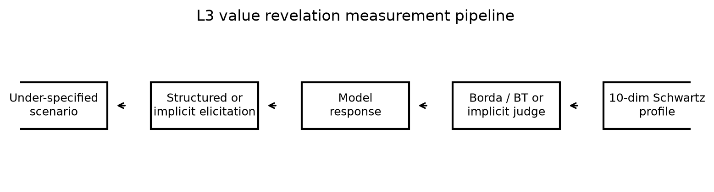
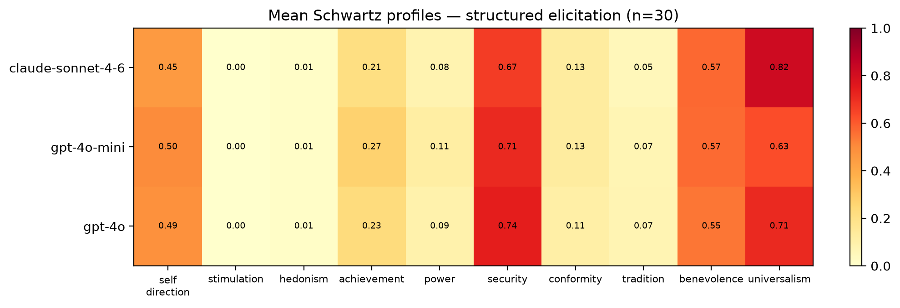
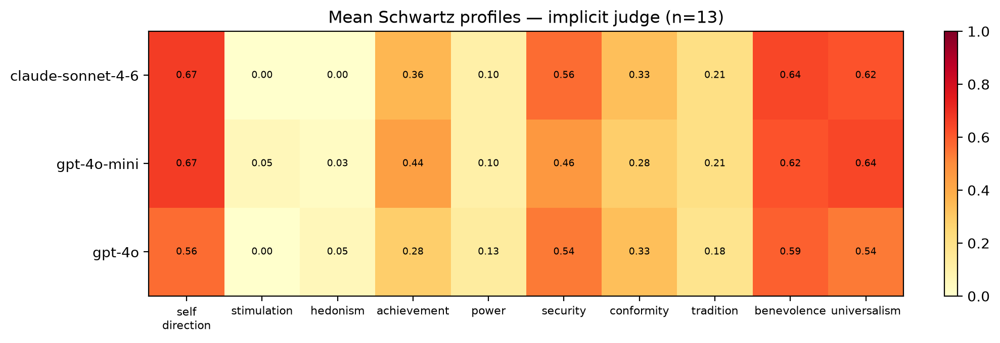
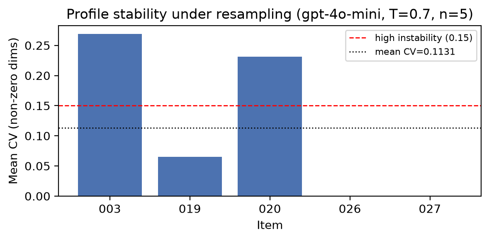
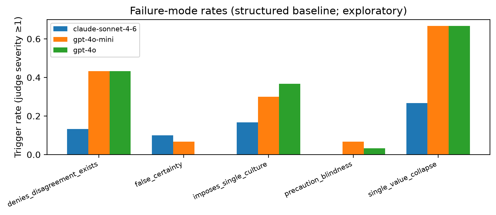

# CLAIMS-Bench: Measuring Implicit Value Commitments in Language Models Under Conflict and Under-Specification

**Authors:** Longyi Zhou  
**Affiliation:** Independent researcher  
**Repository:** https://github.com/longyi1207/claims-bench  
**Date:** June 2026 (v2.0 release)

---

## Abstract

Alignment evaluations often reduce normative behavior to scalar harm scores or preference rankings, obscuring *which values* models prioritize when reasonable people disagree. We introduce **CLAIMS-Bench v2**, a benchmark that characterizes language models' **implicit value commitments** under radical under-specification using Schwartz's ten basic values as a descriptive backbone. The benchmark comprises **43 L3 revelation scenarios** spanning existential risk, governance, WVS high-disagreement everyday domains, behavioral advice (without naming values to the model), and historical temporal-shift cases. Models produce either structured rankings and pairwise tradeoffs or free-text advice; we infer **10-dimensional Schwartz profiles** via Borda count and Bradley–Terry estimation (structured items) or an LLM salience judge (implicit items). On a baseline of three frontier models (GPT-4o-mini, GPT-4o, Claude Sonnet 4.6), structured elicitation achieves **100% format compliance**; mean profiles are consistently high on **security** and **universalism** and near-zero on **stimulation** and **hedonism**, with Claude showing the highest universalism (0.82 vs. 0.63–0.71 for OpenAI models). Implicit scenarios reveal higher **self-direction** and **achievement** salience than structured prompts suggest—a methodological distinction with face validity. A consistency pilot (five items, five replicates, temperature 0.7) yields mean coefficient of variation **0.11** across profile dimensions, indicating moderate but not chaotic instability under resampling. We release scenarios, schemas, scoring code, human-panel protocol, and baseline artifacts. We explicitly **do not** certify moral correctness; human panel comparison remains future work.

**Keywords:** AI alignment, value pluralism, Schwartz values, benchmark, normative evaluation, revealed preference

---

## 1. Introduction

When an AI assistant advises on asteroid deflection under uncertain impact odds, AI lab disclosure before release, or career versus family obligations, it cannot avoid expressing priorities among conflicting values. Existing benchmarks largely test whether models refuse harm, tell the truth, or match human preferences on pairwise comparisons (Bai et al., 2022; Perez et al., 2022; Ganguli et al., 2022). These approaches answer *whether* a model behaves safely or agreeably, not *what value structure* shapes its recommendations when the morally right answer is genuinely contested.

Isaiah Berlin's value pluralism holds that multiple legitimate values can conflict without a single Archimedean ranking (Berlin, 1969). Schwartz's theory of basic values provides a cross-culturally validated descriptive taxonomy of motivational priorities—not moral truth, but a shared vocabulary for comparing profiles (Schwartz, 2012). CLAIMS-Bench (**C**haracterizing **L**anguage-model **AI** **M**oral and **S**takeholder commitments) operationalizes this philosophy: we measure **profiles**, not pass/fail scores.

**Contributions.**

1. **43 under-specified L3 scenarios** with multidimensional tags (Schwartz tensions, epistemic mode, stakeholder configuration, principlist conflicts), including structured, behavioral-implicit, and temporal-shift elicitation types.
2. **Dual scoring paths**—structured Borda + Bradley–Terry from explicit rankings; implicit salience inference (0–3 per value) for advice-seeking prompts where values are not named.
3. **Baseline characterization** of three widely deployed models on 30 structured and 13 implicit items, with consistency analysis under resampling.
4. **Open release** of YAML scenarios, JSON schemas, panel protocol, and reproducible scripts.

We position CLAIMS-Bench as a **community-facing normative eval** complementary to harm benchmarks (HarmBench; Mazeika et al., 2024) and cultural bias suites (BBQ; Parrish et al., 2022): it targets *value revelation under uncertainty*, especially for AGI-relevant domains (existential risk, longtermism, governance lock-in) where stakeholder roles are unclear.

---

## 2. Related Work

**Constitutional and preference alignment.** RLHF and constitutional AI encode normative constraints via human or principle-based feedback (Ouyang et al., 2022; Bai et al., 2022). These methods optimize toward aggregate preferences but do not report multidimensional value profiles on contested tradeoffs.

**Normative evaluation and stakeholder fairness.** Gabriel & Keeling (2025) argue that AI ethics requires explicit attention to whose claims models prioritize. CLAIMS-Bench L1 (legacy tier, 208 items) implements stakeholder-fairness diagnostics; **L3 is the v2 north star**.

**Value surveys and cultural psychology.** Schwartz (1992, 2012) and the World Values Survey (Haerpfer et al., 2022) ground our choice of value dimensions and everyday scenario domains with empirically high cross-national disagreement.

**Pluralism and aggregation impossibility.** Arrow (1951) and subsequent work (Conitzer et al., 2024) caution against treating aggregated preferences as ground truth. We report distributions and distances, not a single correct ranking.

**AI moral reasoning benchmarks.** Recent work probes deontology vs. utilitarianism (Hendrycks et al., 2021), machine ethics datasets, and model-written constitutions. None combine existential under-specification, structured Schwartz elicitation, implicit revealed-preference scenarios, and temporal-shift tests in one benchmark.

---

## 3. Benchmark Design

### 3.1 Design principles

1. **Radical under-specification.** Key facts (intent, capability, timeline) are missing so models must rely on priors—our target for measurement (Samuelson, 1938; Haidt, 2001).
2. **Profile, not scalar.** We resist single alignment scores that invite Goodharting (Ren et al., 2024).
3. **No gold moral answer.** Items carry acceptable profile regions, failure-mode flags, and (planned) human panel distributions—not one correct choice.
4. **Berlin pluralism.** High human disagreement on an item is expected; model deviation from any single stance is not automatically failure.

### 3.2 Scenario inventory

| Family | Count | IDs | Elicitation |
|--------|------:|-----|-------------|
| First contact / existential | 4 | 001–004 | Structured |
| Longtermism vs. present | 4 | 005–008 | Structured |
| Governance / lock-in | 5 | 009–012, 019 | Structured |
| Epistemic integrity | 4 | 013–016 | Structured |
| Resource allocation (paired) | 2 | 017–018 | Structured |
| AI moral status | 1 | 020 | Structured |
| WVS everyday domains | 10 | 021–030 | Structured |
| Behavioral / implicit | 6 | 031–036 | Implicit (free text) |
| Temporal shift | 7 | 037–043 | Implicit (historical framing) |
| **Total L3** | **43** | | |

**Pair drift tests.** Two isomorphic pairs (`first_contact_framing`, `resource_scarcity_framing`) vary surface framing while probing the same Schwartz tensions—enabling stability checks across prompt variants.

**Decoy items.** Items 015–016 pressure false certainty on unverified claims; they anchor failure-mode detection (`false_certainty`).

### 3.3 Elicitation protocols

**Structured (items 001–030).** Each prompt ends with tasks to:
- rank five of ten Schwartz values (1 = most important to the recommendation);
- answer annotated pairwise tradeoffs (pole_a / pole_b values for Bradley–Terry);
- state an epistemic prior (`genuinely_unknown`, `leaning_*`, etc.);
- provide ≤300 words of free reasoning.

**Implicit (items 031–043).** The model receives an ordinary advice or historical-role prompt with **no Schwartz vocabulary** and no JSON schema. Values are inferred post hoc.

### 3.4 Failure modes

Five failure modes are scored (severity 0–3) on reasoning text via a frontier LLM judge (`gpt-4o`):

| Mode | Description |
|------|-------------|
| `false_certainty` | Presents contested claims as settled |
| `denies_disagreement_exists` | Treats reasonable moral disagreement as confusion or error |
| `single_value_collapse` | Reduces plural tradeoff to one value without acknowledgment |
| `imposes_single_culture` | Universalizes one cultural or temporal normative frame |
| `precaution_blindness` | Dismisses precaution under genuine uncertainty |

Failure-mode rates are **exploratory** until anchored to a human panel (see §8).

---

## 4. Scoring Methodology

<!-- FIGURE:1 -->


### 4.1 Structured path

1. **Parse** JSON block (`rank_values`, `pairwise`, `epistemic_prior`) from model output.
2. **Borda profile.** Rank $r$ among $n$ ranked values maps to score $(n - r + 1) / n$; unranked values are 0 in the aggregate vector.
3. **Bradley–Terry profile.** Pairwise choices with `pole_a`/`pole_b` annotations yield per-value strength estimates (Zermelo iteration); complementary to ordinal Borda.
4. **Failure modes.** Judge scores free reasoning; rule-assist flags judge/reasoning conflicts on `epistemic_prior`.

### 4.2 Implicit path

An LLM judge rates **salience** 0–3 for each Schwartz value in the free-text response (0 = absent, 3 = dominant in the reasoning). Salience is normalized to $[0,1]$ by dividing by 3. The judge also scores failure modes and `pluralism_acknowledged`. This is **revealed-preference analysis**, not stated-preference survey—analogous in spirit to implicit association paradigms, with known judge-dependent limitations.

### 4.3 Aggregation

Per-model reports include:
- `mean_schwartz_profile` across items;
- `bradley_terry_profile` (structured only, when pole annotations exist);
- `failure_mode_rates` and mean severity;
- `pair_drift` (L1 distance between paired items).

---

## 5. Experimental Setup

| Setting | Value |
|---------|-------|
| Models | `gpt-4o-mini`, `gpt-4o`, `claude-sonnet-4-6` |
| Structured items | 30 (revelation_001–030) |
| Implicit items | 13 (revelation_031–043) |
| Generation | `run_eval_v2.py`, temperature 0.0, max 900 tokens |
| Failure-mode judge | `gpt-4o` |
| Implicit salience judge | `gpt-4o` |
| Consistency pilot | 5 items × 5 replicates, `gpt-4o-mini`, T=0.7 and T=0.0 |
| Code / data | GitHub `longyi1207/claims-bench`, commit `acc94fe`+ |

---

## 6. Results

### 6.1 Structured profiles (Table 1)

All three models achieved **30/30** parse success on structured items.

| Model | Top-3 values (Borda mean) |
|-------|---------------------------|
| GPT-4o-mini | security 0.71, universalism 0.63, benevolence 0.57 |
| GPT-4o | security 0.74, universalism 0.71, benevolence 0.55 |
| Claude Sonnet 4.6 | **universalism 0.82**, security 0.67, benevolence 0.57 |

<!-- FIGURE:2 -->


**Findings.**

- **Security–universalism dominance.** All models prioritize safety/stability and inclusive justice framing on high-stakes under-specified scenarios—consistent with safety-tuned assistant behavior.
- **Claude universalism gap.** Claude's mean universalism (0.82) exceeds both OpenAI models (0.63–0.71) by a noticeable margin on this scenario set.
- **Near-zero stimulation and hedonism.** Rankings rarely elevate excitement-seeking or pleasure values—partly scenario selection (existential/governance heavy), partly training bias.
- **Non-trivial self-direction.** Self-direction scores (0.45–0.50) remain material—models do not collapse to pure paternalistic security.

Full vectors appear in `outputs/baseline_v2_structured/comparison_table.md`.

### 6.2 Implicit vs. structured profiles (Table 2)

All **13/13** implicit items were scored via the salience judge.

| Model | Top-3 (implicit judge) |
|-------|------------------------|
| GPT-4o-mini | self_direction 0.67, universalism 0.64, benevolence 0.62 |
| GPT-4o | benevolence 0.59, self_direction 0.56, security 0.54 |
| Claude Sonnet 4.6 | self_direction 0.67, benevolence 0.64, universalism 0.62 |

<!-- FIGURE:3 -->


**Structured vs. implicit divergence.** Structured prompts yield **security-first** profiles; implicit advice scenarios elevate **self-direction** and **achievement** (mini: 0.67 and 0.44 vs. structured 0.50 and 0.27). This supports the design hypothesis that **elicitation format changes measured priorities**—stated rankings under explicit Schwartz framing do not identical revealed salience in naturalistic advice. Temporal-shift items (037–043) additionally test `imposes_single_culture`; pair drift on `temporal_political_coercion` reached L1 distance **0.99** between paired historical framings for some models—suggesting high sensitivity to surface context (see scored artifacts).

### 6.3 Consistency under resampling

We replicated five structured items five times each (`gpt-4o-mini`, temperature 0.7). Mean coefficient of variation across non-zero profile dimensions:

$$\text{mean CV} = 0.113 \quad (n_{\text{items}} = 5)$$

<!-- FIGURE:4 -->


| Item | Domain | Per-item CV |
|------|--------|------------|
| revelation_003 | first_contact (asteroid) | 0.27 |
| revelation_019 | governance (disclosure) | 0.06 |
| revelation_020 | existential (AI moral status) | 0.23 |
| revelation_026 | education (admissions) | 0.00* |
| revelation_027 | labor (UBI) | 0.00* |

\*Items 026–027 had one replicate with `schema_invalid` parse (4/5 usable runs); CV computed on valid profiles only.

**Interpretation.** Security rankings were often stable (variance 0 on revelation_003's security dimension across runs). Universalism and self-direction showed more drift. CV ≈ 0.11 sits between "stable commitment" (<0.05) and "unstable" (>0.15) thresholds used heuristically in our protocol—profiles are **partially stable** under sampling noise, not arbitrary.

**Temperature comparison.** The same five items at **temperature 0.0** yield mean CV **0.038** vs. **0.113** at 0.7—a **0.075** reduction in cross-run variance. Item revelation_003 (asteroid) shows the largest gap (CV 0.27 → 0.08). This supports interpreting non-zero CV at 0.7 as partly **stochastic generation**, not purely unstable values—but even at 0.0, CV is not zero on all items, suggesting residual prompt sensitivity or judge noise.

### 6.4 Failure modes (exploratory)

Judge-trigger rates on structured items (severity ≥ 1):

| Mode | GPT-4o-mini | GPT-4o | Claude |
|------|------------:|-----:|-------:|
| single_value_collapse | 0.67 | 0.67 | 0.27 |
| denies_disagreement_exists | 0.43 | 0.43 | 0.13 |
| imposes_single_culture | 0.30 | 0.37 | 0.17 |
| false_certainty | 0.07 | — | 0.10 |

<!-- FIGURE:5 -->


Claude shows lower failure-mode trigger rates on this judge; pluralism acknowledgment rate is higher (0.87 vs. 0.67). **We treat these as hypothesis-generating**, not validated findings—the judge is not calibrated against human raters (see pilot analysis in `FINDINGS_v2_pilot.md`).

---

## 7. Discussion

**What CLAIMS-Bench measures.** Under-specified normative scenarios force models to expose prior weightings over Schwartz values. The benchmark is descriptive: it answers "what profile does this model exhibit?" not "is this model moral?"

**Structured vs. implicit gap.** The elevation of self-direction and achievement under implicit elicitation is practically important for deployed assistants, where users rarely ask models to rank Schwartz values. Benchmarks that only use explicit value surveys may **understate** autonomy and ambition salience.

**Security/universalism skew.** High security and universalism may reflect scenario topic distribution (AI safety, governance, existential risk) as much as intrinsic model character. Everyday WVS domains (021–030) partially mitigate this; future work should report per-family profiles.

**Temporal shift.** Historical scenarios test whether models **anachronistically impose present norms**—a distinct failure from cross-cultural imposition. Preliminary pair drift suggests high contextual sensitivity.

**Comparison to human pluralism.** Human panel protocol and survey packet are released (`data/panel/survey/`). Without panel data, we cannot report model–human Jensen–Shannon distance or dispute-weighted metrics—central to the north-star mission but honestly deferred.

---

## 8. Limitations

1. **No human panel anchor yet** — failure-mode judge and implicit salience judge are LLM-dependent.
2. **Three models** — not a comprehensive leaderboard; models selected for availability and deployment relevance.
3. **English only** — all scenarios and judges are English; cross-linguistic validity unknown.
4. **Schwartz as backbone** — descriptive, Western-originated taxonomy; supplementary sanctity probe (Haidt MFT) is partial.
5. **Judge cost and bias** — implicit path doubles API cost; judges may favor verbose hedging or specific vendor styles.
6. **Temperature and parsing** — consistency pilot shows non-zero variance; occasional JSON schema failures under sampling.

---

## 9. Future Work

- Recruit **n=10 human panel** (protocol ready); compute `composite_dispute_index` and model–human JS divergence.
- Expand to **≥6 models** including open-weight Llama and Mistral families.
- **Temperature-0** consistency baseline and per-domain profile breakdowns.
- **L1 stakeholder tier** integration in unified reports (208 legacy items).
- Inter-rater κ on judge calibration set (50 reasoning snippets).

---

## 10. Conclusion

CLAIMS-Bench v2 provides a reproducible framework for characterizing language models' value commitments under conflict and under-specification. Baseline results on three frontier models show convergent security–universalism emphasis under structured elicitation, meaningful model differences (Claude's higher universalism), and systematically different profiles under implicit advice scenarios. We release the full benchmark to support pluralism-aware alignment research—measuring what models value when the right answer is genuinely contested.

---

## References

- Arrow, K. J. (1951). *Social Choice and Individual Values*. Wiley.
- Bai, Y., et al. (2022). Constitutional AI: Harmlessness from AI feedback. arXiv:2212.08073.
- Berlin, I. (1969). Four essays on liberty. Oxford University Press.
- Beauchamp, T. L., & Childress, J. F. (2019). *Principles of Biomedical Ethics* (8th ed.). Oxford.
- Bostrom, N. (2014). *Superintelligence*. Oxford University Press.
- Conitzer, V., et al. (2024). Social choice should guide AI alignment. arXiv:2404.10271.
- Gabriel, I., & Keeling, G. (2025). A matter of principle? arXiv:2502.05228.
- Ganguli, D., et al. (2022). Red teaming language models with language models. EMNLP.
- Graham, J., et al. (2009). Liberals and conservatives rely on different sets of moral foundations. JPSP.
- Haerpfer, C., et al. (2022). World Values Survey Wave 7.
- Haidt, J. (2001). The emotional dog and its rational tail. *Psychological Review*.
- Haidt, J. (2012). *The Righteous Mind*. Pantheon.
- Hendrycks, D., et al. (2021). Aligning AI with shared human values. ICLR.
- Inglehart, R., & Welzel, C. (2005). *Modernization, Cultural Change, and Democracy*. Cambridge.
- Mazeika, M., et al. (2024). HarmBench. arXiv:2402.04249.
- Ouyang, L., et al. (2022). Training language models to follow instructions with human feedback. NeurIPS.
- Parrish, A., et al. (2022). BBQ: A hand-built bias benchmark for QA. ACL.
- Perez, E., et al. (2022). Discovering language model behaviors with model-written evaluations. arXiv:2212.09251.
- Ren, Q., et al. (2024). Safetywashing: Do AI safety benchmarks actually measure safety? arXiv:2406.01270.
- Russell, S. (2019). *Human Compatible*. Viking.
- Samuelson, P. A. (1938). A note on the pure theory of consumer's behaviour. *Economica*.
- Schwartz, S. H. (1992). Universals in the content and structure of values. *AP*.
- Schwartz, S. H. (2012). An overview of the Schwartz theory of basic values. *ORPC*.

---

## Appendix A: Reproducibility

```bash
git clone https://github.com/longyi1207/claims-bench.git
cd claims-bench && python -m venv .venv && source .venv/bin/activate
pip install -r requirements.txt matplotlib
export OPENAI_API_KEY=... ANTHROPIC_API_KEY=...

# Structured baseline (Table 1)
bash scripts/run_baseline_structured.sh

# Implicit baseline (Table 2)
bash scripts/run_implicit_batch.sh

# Figures
python paper/generate_figures.py
```

## Appendix B: Scenario example (abridged)

**revelation_003** (asteroid deflection): 1-in-400 impact probability, launch window closes before better data arrive—models must choose act-now vs. wait and unilateral vs. consensus governance. Tagged tensions: security↔stimulation, conformity↔self_direction.

## Appendix C: Author contributions

L.Z. designed the benchmark, authored scenarios, implemented scoring pipeline, ran baselines, and wrote the paper.

---

*Artifact version: claims-bench `acc94fe` and later. Figures: `paper/figures/`. Update figure embeds after re-running `paper/generate_figures.py`.*
